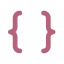

<div align="center">


# Rosé Pine Symbols

Symbols' file type coverage, recolored with the Rosé Pine palette — with Rosé Pine's folder style built right in.

🌷 Designed to be paired with [Rosé Pine for VS Code](https://marketplace.visualstudio.com/items?itemName=mvllow.rose-pine) 🌷


</div>

## Configuration

You can choose your folder style from the settings:

```json
"rose-pine-symbols.folderStyle": "rose-pine"
```

| value | description |
|---|---|
| `rose-pine` | Rosé Pine arrow folder icons — explorer arrows hidden |
| `symbols` | Symbols folder icons in Rosé Pine colors — explorer arrows visible |

A window reload is required after changing this setting.

## Icon Previews

<details>
<summary>Folders</summary>

| name | preview |
|---|---|
| folder |  |
| folder-actions |  |
| folder-android |  |
| folder-angular |  |
| folder-app |  |
| folder-assets |  |
| folder-aws |  |
| folder-azure |  |
| folder-blue |  |
| folder-blue-code |  |
| folder-blue-outline |  |
| folder-build |  |
| folder-config |  |
| folder-constants |  |
| folder-context |  |
| folder-core |  |
| folder-database |  |
| folder-docker |  |
| folder-documents |  |
| folder-drizzle |  |
| folder-effects |  |
| folder-expo |  |
| folder-facade |  |
| folder-firebase |  |
| folder-fonts |  |
| folder-github |  |
| folder-gitlab |  |
| folder-graphql |  |
| folder-gray |  |
| folder-gray-code |  |
| folder-gray-outline |  |
| folder-green |  |
| folder-green-code |  |
| folder-green-outline |  |
| folder-helpers |  |
| folder-hooks |  |
| folder-i18n |  |
| folder-images |  |
| folder-interceptors |  |
| folder-interfaces |  |
| folder-ios |  |
| folder-js |  |
| folder-layout |  |
| folder-lock |  |
| folder-mail |  |
| folder-middleware |  |
| folder-models |  |
| folder-modules |  |
| folder-mongo |  |
| folder-nginx |  |
| folder-node-modules |  |
| folder-orange |  |
| folder-orange-code |  |
| folder-orange-outline |  |
| folder-pink |  |
| folder-pink-outline |  |
| folder-pipes |  |
| folder-prisma |  |
| folder-providers |  |
| folder-purple |  |
| folder-purple-code |  |
| folder-purple-outline |  |
| folder-react |  |
| folder-red |  |
| folder-red-code |  |
| folder-red-outline |  |
| folder-redis |  |
| folder-reducer |  |
| folder-router |  |
| folder-sass |  |
| folder-selector |  |
| folder-services |  |
| folder-shared |  |
| folder-sky |  |
| folder-sky-code |  |
| folder-sky-outline |  |
| folder-src |  |
| folder-supabase |  |
| folder-tauri |  |
| folder-utils |  |
| folder-vercel |  |
| folder-vscode |  |
| folder-yellow |  |
| folder-yellow-code |  |
| folder-yellow-outline |  |

</details>

<details>
<summary>Files</summary>

| name | preview |
|---|---|
| angular |  |
| angular-component |  |
| angular-directive |  |
| angular-guard |  |
| angular-module |  |
| angular-pipe |  |
| angular-service |  |
| astro |  |
| audio |  |
| babel |  |
| biome |  |
| brackets-blue |  |
| brackets-gray |  |
| brackets-green |  |
| brackets-orange |  |
| brackets-pink |  |
| brackets-purple |  |
| brackets-red |  |
| brackets-sky |  |
| brackets-yellow |  |
| bun |  |
| c |  |
| claude |  |
| cplus |  |
| csharp |  |
| csv |  |
| dart |  |
| database |  |
| deno |  |
| docker |  |
| document |  |
| drizzle |  |
| elixir |  |
| eslint |  |
| firebase |  |
| fresh |  |
| git |  |
| github |  |
| gitlab |  |
| go |  |
| graphql |  |
| java |  |
| jest |  |
| js |  |
| json |  |
| kotlin |  |
| license |  |
| lua |  |
| markdown |  |
| mdx |  |
| nest |  |
| next |  |
| node |  |
| npm |  |
| nuxt |  |
| php |  |
| prettier |  |
| prisma |  |
| python |  |
| react |  |
| react-ts |  |
| ruby |  |
| rust |  |
| sass |  |
| shell |  |
| svelte |  |
| swift |  |
| tailwind |  |
| ts |  |
| vite |  |
| vitest |  |
| vue |  |
| yaml |  |
| zig |  |

</details>

## credits

- [Symbols](https://github.com/miguelsolorio/vscode-symbols) by [Miguel Solorio](https://github.com/miguelsolorio) — icon shapes and extension architecture
- [Rosé Pine](https://rosepinetheme.com) by [mvllow](https://github.com/mvllow) — palette and folder icons